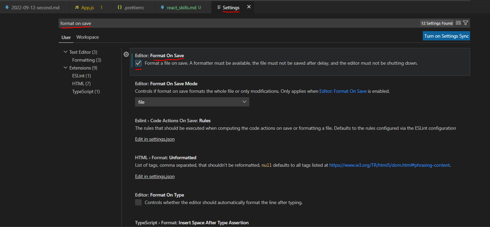

# react_skills

## 리액트를 다루는 기술

---

### 1. 리액트 시작

- Yarn 설치

```
# yarn install via npm
npm install --global yarn

# yarn version check
yarn --version
```

- 새 프로젝트 만들어보기

```
$ yarn create react-app hello-react

$ hello-react
$ yarn start
```

---

### 2. JSX

- Prettier Options 페이지(https://prettier.io/docs/en/options.html)

#### 2.5 저장할 때 자동으로 코드정리하기

1. VS Code 환경 설정 : 파일 > 기본 설정 > 설정 메뉴
2. 상단 텍스트 박스에서 "format on save" 검색
3. 체크박스에 체크

- 저장할 때마다 코드가 자동으로 정리
  </img><br/>

---

### 3. 컴포넌트

- ㅁ

---

### 4.

- ㅁ

---

### 5.

- ㅁ

---

### 6. 컴포넌트 반복

- ㅁ

```JS
// IterationSample.js

import { useState } from 'react';

const IterationSample = () => {
	const [names, setNames] = useState([
		{ id: 1, text: '눈사람' },
		{ id: 2, text: '얼음' },
		{ id: 3, text: '눈' },
		{ id: 4, text: '바람' },
	]);

	const [inputText, setInputText] = useState('');
	const [nextId, setNextId] = useState(5);

	const onChange = (e) => setInputText(e.target.value);
	const onClick = () => {
		const nextNames = names.concat({
			id: nextId,
			text: inputText,
		});
		setNextId(nextId + 1);
		setNames(nextNames);
		setInputText('');
	};

	const onRemove = (id) => {
		const nextNames = names.filter((name) => name.id !== id);
		setNames(nextNames);
	};

	const namesList = names.map((name) => (
		<li key={name.id} onDoubleClick={() => onRemove(name.id)}>
			{name.text}
		</li>
	));

	return (
		<>
			<input value={inputText} onChange={onChange} />
			<button onClick={onClick}>추가</button>
			<ul>{namesList}</ul>
		</>
	);
};

export default IterationSample;

```

---

### 7. 컴포넌트의 라이프사이클 메서드

- ㅁ

---

### 8. Hooks

```
yarn create react-app hooks-tutorial
```

- useState
- useEffect
- useReducer

---

### 9. 컴포넌트 스타일링

```
yarn create react-app styling-react
cd styling-react
yarn start
```

- CSS Selector

```CSS
// App.css

```

- Sass

```
// sass 라이브러리 설치
yarn add sass
```

```CSS
// 변수 사용하기
$red: #fa5252;
$orange: #fd7e14;
$yellow: #fcc419;
$green: #40c057;
$blue: #339af0;
$indigo: #5c7cfa;
$violet: #7950f2;

// 믹스인 만들기(재사용되는 스타일 블록을 함수처럼 사용할 수 있음)
@mixin square($size) {
    $calculated: 32px * $size;
    width: $calculated;
    height: $calculated;
}

.SassComponent {
    display: flex;
    .box {  // 일반 CSS에서는 .SassComponent .box와 마찬가지
        background: red;
        cursor: pointer;
        transition: all 0.3s ease-in;
        &.red {
            // .red 클래스가 .box와 함께 사용되었을 때
            background: $red;
            @include square(1);
        }
        &.orange {
            background: $orange;
            @include square(2);
        }
        &.yellow {
            background: $yellow;
            @include square(3);
        }
        &.green {
            background: $green;
            @include square(4);
        }
        &.blue {
            background: $blue;
            @include square(5);
        }
        &.indigo {
            background: $indigo;
            @include square(6);
        }
        &.violet {
            background: $violet;
            @include square(7);
        }
        &:hover {
            // .box에 마우스를 올렸을 때
            background: black;
        }
    }
}
```

- Sass 라이브러리 설치
  - include-media : 반응형 디자인을 쉽게 만들어줌
  - open-color : 매우 편리한 색상 팔레트

```
yarn add open-color include-media
```

- classnames 라이브러리 설치

```
yarn add classnames
```

- styled-components 라이브러리 설치

```
yarn add styled-components
```

- vscode-styled-components 설치

---

### 10. 일정관리 웹 애플리케이션 만들기

-abc

---

### 11. 컴포넌트 성능 최적화

-abc

---

### 12. immer를 사용하여 더 쉽게 불변성 유지하기

-abc

---

### 13. 리액트 라우터로 SPA 개발하기

-abc

---

### 14. asdf

- abc

---

### 15. asdf

- abc

---

### 16. 리덕스 라이브러리 이해하기

- abc

---

### 17. 리덕스를 사용하여 리액트 애플리케이션 상태 관리하기

- abc

---

### 18. 리덕스 미들웨어를 통한 비동기 작업 관리

- abc

---

...

---

### 21.백엔드 프로그래밍: Node.js의 Koa 프레임워크

- Node.js 런타임 설치 확인

```
node --version
```
