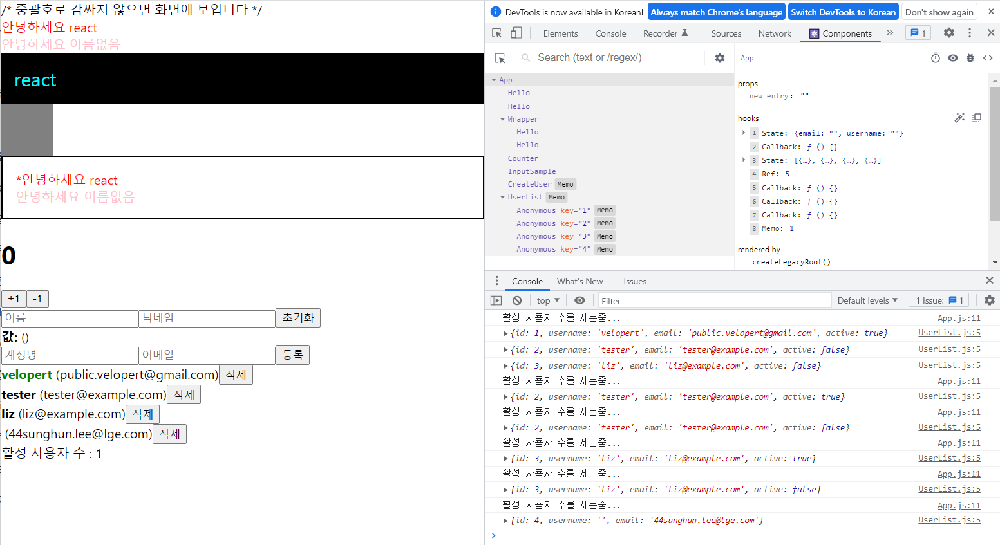

# react_module

## velopert
---
### 1. 작업환경 준비
- Yarn 설치
```
# yarn install via npm
npm install --global yarn

# yarn version check
yarn --version
```

- 새 프로젝트 만들어보기
```
$ npx create-react-app begin-react

$ cd begin-react
$ yarn start
```
---
### 2. 첫번째 리액트 컴포넌트
- src 디렉터리에 Hello.js 라는 파일을 다음과 같이 작성
```
import React from 'react';

function Hello() {
  return <div>안녕하세요</div>
}

export default Hello;
```
---
### 3. JSX
- 리액트에서 생김새를 정의할 때, 사용하는 문법
- 리액트 컴포넌트 파일에서 XML 형태로 코드를 작성하면 babel 이 JSX 를 JavaScript 로 변환

- Babel 은 자바스크립트의 문법을 확장해주는 도구
- 아직 지원되지 않는 최신 문법이나, 편의상 사용하거나 실험적인 자바스크립트 문법들을 정식 자바스크립트 형태로 변환해줌으로서 구형 브라우저같은 환경에서도 제대로 실행 할 수 있게 해주는 역할

- HTML 에서는 *input* 또는 *br* 태그를 사용 할 때 닫지 않고 사용하기도 합니다. 하지만 리액트에서는 그렇게 하면 안됩니다.
```
import React from 'react';
import Hello from './Hello';

function App() {
  return (
    <div>
      <Hello />
      <Hello />
      <Hello />
      <input />
      <br />
    </div>
  );
}

export default App;
```

- 태그를 작성 할 때 이름 없이 작성을 하게 되면 Fragment 가 만들어지는데, Fragment 는 브라우저 상에서 따로 별도의 엘리먼트로 나타나지 않습니다.
```
import React from 'react';
import Hello from './Hello';

function App() {
  return (
    <>
      <Hello />
      <div>안녕히계세요</div>
    </>
  );
}

export default App;
```

- JSX 내부에 자바스크립트 변수를 보여줘야 할 때에는 {} 으로 감싸서 보여줍니다.
```
import React from 'react';
import Hello from './Hello';

function App() {
  const name = 'react';
  return (
    <>
      <Hello />
      <div>{name}</div>
    </>
  );
}

export default App;
```

- 인라인 스타일은 객체 형태로 작성을 해야 하며, background-color 처럼 - 로 구분되어 있는 이름들은 backgroundColor 처럼 camelCase 형태로 네이밍 
```
import React from 'react';
import Hello from './Hello';

function App() {
  const name = 'react';
  const style = {
    backgroundColor: 'black',
    color: 'aqua',
    fontSize: 24, // 기본 단위 px
    padding: '1rem' // 다른 단위 사용 시 문자열로 설정
  }

  return (
    <>
      <Hello />
      <div style={style}>{name}</div>
    </>
  );
}

export default App;
```

- JSX 내부의 주석은 {/* 이런 형태로 */} 작성
- 열리는 태그 내부에서는 // 이런 형태로도 주석 작성이 가능
```
import React from 'react';
import Hello from './Hello';
import './App.css';


function App() {
  const name = 'react';
  const style = {
    backgroundColor: 'black',
    color: 'aqua',
    fontSize: 24, // 기본 단위 px
    padding: '1rem' // 다른 단위 사용 시 문자열로 설정
  }

  return (
    <>
      {/* 주석은 화면에 보이지 않습니다 */}
      /* 중괄호로 감싸지 않으면 화면에 보입니다 */
      <Hello 
        // 열리는 태그 내부에서는 이렇게 주석을 작성 할 수 있습니다.
      />
      <div style={style}>{name}</div>
      <div className="gray-box"></div>
    </>
  );
}

export default App;
```
---
### 4. props 를 통해 컴포넌트에게 값 전달하기
- props 는 properties 의 줄임말
- 우리가 어떠한 값을 컴포넌트에게 전달해줘야 할 때, props 를 사용

#### 4-1. props 의 기본 사용법
- App 컴포넌트에서 Hello 컴포넌트를 사용 할 때 name 이라는 값을 전달해주고 싶다고 가정
```
// App.js
import React from 'react';
import Hello from './Hello';

function App() {
  return (
    <Hello name="react" />
  );
}

export default App;
```
- Hello 컴포넌트에서 name 값을 사용 하고 싶을 땐
```
// Hello.js

import React from 'react';

function Hello(props) {
  return <div>안녕하세요 {props.name}</div>
}

export default Hello;
```
#### 4-2. 여러개의 props, 비구조화 할당
- Hello 컴포넌트에 또 다른 props 를 전달해봅시다. color 라는 값을 설정해보세요.
```
// App.js

import React from 'react';
import Hello from './Hello';

function App() {
  return (
    <Hello name="react" color="red"/>
  );
}

export default App;
```
```
// Hello.js

import React from 'react';

function Hello(props) {
  return <div style={{ color: props.color }}>안녕하세요 {props.name}</div>
}

export default Hello;
```
- props 내부의 값을 조회 할 때마다 props. 를 입력하고 있는데요, 함수의 파라미터에서 비구조화 할당 (혹은 구조 분해라고도 불립니다) 문법을 사용하면 조금 더 코드를 간결하게 작성
```
// Hello.js

import React from 'react';

function Hello({ color, name }) {
  return <div style={{ color }}>안녕하세요 {name}</div>
}

export default Hello;
```

#### 4-3. defaultProps 로 기본값 설정
- 컴포넌트에 props 를 지정하지 않았을 때 기본적으로 사용 할 값을 설정하고 싶다면 컴포넌트에 defaultProps 라는 값을 설정
```
import React from 'react';

function Hello({ color, name }) {
  return <div style={{ color }}>안녕하세요 {name}</div>
}

Hello.defaultProps = {
  name: '이름없음'
}

export default Hello;
```

#### 4-4. props.children
- 컴포넌트 태그 사이에 넣은 값을 조회하고 싶을 땐, props.children 을 조회
- 내부의 내용이 보여지게 하기 위해서는 Wrapper 에서 props.children 을 렌더링
```
// in Wrapper.js

import React from 'react';

function Wrapper({ children }) {
  const style = {
    border: '2px solid black',
    padding: '16px',
  };
  return (
    <div style={style}>
      {children}
    </div>
  )
}

export default Wrapper;
```
```
// in App.js

import React from 'react';
import Hello from './Hello';
import Wrapper from './Wrapper';

function App() {
  return (
    <Wrapper>
      <Hello name="react" color="red"/>
      <Hello color="pink"/>
    </Wrapper>
  );
}

export default App;
```
---
### 5. 조건부 렌더링
- 조건부 렌더링이란, 특정 조건에 따라 다른 결과물을 렌더링
```
// App.js

import React from 'react';
import Hello from './Hello';
import Wrapper from './Wrapper';


function App() {
  return (
    <Wrapper>
      <Hello name="react" color="red" isSpecial={true}/>
      <Hello color="pink" />
    </Wrapper>
  )
}

export default App;
```
- isSpecial 값이 true 라면 <b>*</b> 를, 그렇지 않다면 null 을 보여주도록 했습니다. 참고로 JSX 에서 null, false, undefined 를 렌더링하게 된다면 아무것도 나타나지 않는다.
```
// Hello.js

import React from 'react';

function Hello({ color, name, isSpecial }) {
  return (
    <div style={{ color }}>
      { isSpecial ? <b>*</b> : null }
      안녕하세요 {name}
    </div>
  );
}

Hello.defaultProps = {
  name: '이름없음'
}

export default Hello;
```
- 단순히 특정 조건이 true 이면 보여주고, 그렇지 않다면 숨겨주고 있는데요, 이러한 상황에서는 && 연산자를 사용해서 처리하는 것이 더 간편
```
// Hello.js

import React from 'react';

function Hello({ color, name, isSpecial }) {
  return (
    <div style={{ color }}>
      {isSpecial && <b>*</b>}
      안녕하세요 {name}
    </div>
  );
}

Hello.defaultProps = {
  name: '이름없음'
}

export default Hello;
```

#### 5-1. props 값 설정을 생략하면 ={true}
- 컴포넌트의 props 값을 설정하게 될 때 만약 props 이름만 작성하고 값 설정을 생략한다면, 이를 true 로 설정한 것으로 간주
```
// App.js

import React from 'react';
import Hello from './Hello';
import Wrapper from './Wrapper';

function App() {
  return (
    <Wrapper>
      <Hello name="react" color="red" isSpecial />
      <Hello color="pink"/>
    </Wrapper>
  );
}

export default App;
```
- 이렇게 isSpecial 이름만 넣어주면 isSpecial={true} 와 동일한 의미

---
### 6. useState 를 통해 컴포넌트에서 바뀌는 값 관리하기
- 컴포넌트에서 보여줘야 하는 내용이 사용자 인터랙션에 따라 바뀌어야 할 때 구현 방법
- 리액트 16.8 에서 **Hooks 라는 기능이 도입**되면서 **함수형 컴포넌트에서도 상태를 관리**할 수 있게 되었음
- useState 라는 함수를 사용해보게 되는데, 이게 바로 리액트의 Hooks 중 하나
```
// Counter.js

import React from 'react';

function Counter() {
  return (
    <div>
      <h1>0</h1>
      <button>+1</button>
      <button>-1</button>
    </div>
  );
}

export default Counter;
```
```
// App.js

import React from 'react';
import Counter from './Counter';

function App() {
  return (
    <Counter />
  );
}

export default App;
```

#### 6-1. 이벤트 설정
- Counter 에서 버튼이 클릭되는 이벤트가 발생 했을 때, 특정 함수가 호출되도록 설정
```
// Counter.js

import React from 'react';

function Counter() {
  const onIncrease = () => {
    console.log('+1')
  }
  const onDecrease = () => {
    console.log('-1');
  }
  return (
    <div>
      <h1>0</h1>
      <button onClick={onIncrease}>+1</button>
      <button onClick={onDecrease}>-1</button>
    </div>
  );
}

export default Counter;
```
- 여기서 주의하셔야 하는 점은, 함수형태를 넣어주어야 하지, 함수를 다음과 같이 실행하시면 안됩니다.
```
onClick={onIncrease()}
```
- 이렇게 하면 렌더링되는 시점에서 함수가 호출되버리기 때문입니다. 이벤트를 설정할때에는 함수타입의 값을 넣어주어야 한다는 것, 주의


#### 6-2. 동적인 값 끼얹기, useState
- 컴포넌트에서 동적인 값을 상태(state)라고 부릅니다. 리액트에 useState 라는 함수가 있는데요, 이것을 사용하면 컴포넌트에서 상태를 관리
```
// Counter.js

import React, { useState } from 'react';

function Counter() {
  const [number, setNumber] = useState(0);

  const onIncrease = () => {
    setNumber(number + 1);
  }

  const onDecrease = () => {
    setNumber(number - 1);
  }

  return (
    <div>
      <h1>{number}</h1>
      <button onClick={onIncrease}>+1</button>
      <button onClick={onDecrease}>-1</button>
    </div>
  );
}

export default Counter;
```
- useState 를 사용 할 때에는 상태의 기본값을 파라미터로 넣어서 호출해줍니다. 이 함수를 호출해주면 배열이 반환되는데요, 여기서 첫번째 원소는 현재 상태, 두번째 원소는 Setter 함수입니다.

```
const numberState = useState(0);
const number = numberState[0];
const setNumber = numberState[1];
```

#### 6-3. 함수형 업데이트
- 지금은 Setter 함수를 사용 할 때, 업데이트 하고 싶은 새로운 값을 파라미터로 넣어주고 있는데요, 그 대신에 기존 값을 어떻게 업데이트 할 지에 대한 함수를 등록하는 방식으로도 값을 업데이트 할 수 있습니다.
```
// Counter.js

import React, { useState } from 'react';

function Counter() {
  const [number, setNumber] = useState(0);

  const onIncrease = () => {
    setNumber(prevNumber => prevNumber + 1);
  }

  const onDecrease = () => {
    setNumber(prevNumber => prevNumber - 1);
  }

  return (
    <div>
      <h1>{number}</h1>
      <button onClick={onIncrease}>+1</button>
      <button onClick={onDecrease}>-1</button>
    </div>
  );
}

export default Counter;
```
- onIncrease 와 onDecrease 에서 setNumber 를 사용 할 때 그 다음 상태를 파라미터로 넣어준것이 아니라, 값을 업데이트 하는 함수를 파라미터로 넣어주었습니다.
- 함수형 업데이트는 주로 나중에 **컴포넌트를 최적화**를 하게 될 때 사용

---
### 7. input 상태 관리하기
- 리액트에서 사용자가 입력 할 수 있는 input 태그의 상태를 관리하는 방법
```
// InputSample.js

import React from 'react';

function InputSample() {
  return (
    <div>
      <input />
      <button>초기화</button>
      <div>
        <b>값: </b>
      </div>
    </div>
  );
}

export default InputSample;
```
```
// App.js

import React from 'react';
import InputSample from './InputSample';

function App() {
  return (
    <InputSample />
  );
}

export default App;
```

- input 의 onChange 라는 이벤트를 사용
- 이벤트에 등록하는 함수에서는 이벤트 객체 e 를 파라미터로 받아와서 사용 할 수 있는데 이 객체의 e.target 은 이벤트가 발생한 DOM 인 input DOM 을 가르키게됨
```
// InputSample.js

import React, { useState } from 'react';

function InputSample() {
  const [text, setText] = useState('');

  const onChange = (e) => {
    setText(e.target.value);
  };

  const onReset = () => {
    setText('');
  };

  return (
    <div>
      <input onChange={onChange} value={text}  />
      <button onClick={onReset}>초기화</button>
      <div>
        <b>값: {text}</b>
      </div>
    </div>
  );
}

export default InputSample;
```
- input 의 상태를 관리할 때에는 input 태그의 value 값도 설정해주는 것이 중요합니다. 그렇게 해야, 상태가 바뀌었을때 input 의 내용도 업데이트

---
### 8. 여러개의 input 상태 관리하기
-  input 이 여러개일때는 어떻게 관리
```
// InputSample.js

import React, { useState } from 'react';

function InputSample() {
  const onChange = (e) => {
  };

  const onReset = () => {
  };


  return (
    <div>
      <input placeholder="이름" />
      <input placeholder="닉네임" />
      <button onClick={onReset}>초기화</button>
      <div>
        <b>값: </b>
        이름 (닉네임)
      </div>
    </div>
  );
}

export default InputSample;
```

- input 의 개수가 여러개가 됐을때는, 단순히 useState 를 여러번 사용하고 onChange 도 여러개 만들어서 구현 할 수 있습니다. 
- 하지만 그 방법은 가장 좋은 방법은 아닙니다. 더 좋은 방법은, **input 에 name 을 설정하고 이벤트가 발생했을 때 이 값을 참조**하는 것입니다. 그리고, useState 에서는 문자열이 아니라 객체 형태의 상태를 관리해주어야 합니다.
```
// InputSample.js

import React, { useState } from 'react';

function InputSample() {
  const [inputs, setInputs] = useState({
    name: '',
    nickname: ''
  });

  const { name, nickname } = inputs; // 비구조화 할당을 통해 값 추출

  const onChange = (e) => {
    const { value, name } = e.target; // 우선 e.target 에서 name 과 value 를 추출
    setInputs({
      ...inputs, // 기존의 input 객체를 복사한 뒤
      [name]: value // name 키를 가진 값을 value 로 설정
    });
  };

  const onReset = () => {
    setInputs({
      name: '',
      nickname: '',
    })
  };


  return (
    <div>
      <input name="name" placeholder="이름" onChange={onChange} value={name} />
      <input name="nickname" placeholder="닉네임" onChange={onChange} value={nickname}/>
      <button onClick={onReset}>초기화</button>
      <div>
        <b>값: </b>
        {name} ({nickname})
      </div>
    </div>
  );
}

export default InputSample;
```

- 리액트 상태에서 객체를 수정해야 할 때에는, 이런식으로 직접 수정하면 안됩니다.
```
inputs[name] = value;
```

- 새로운 객체를 만들어서 새로운 객체에 변화를 주고, 이를 상태로 사용
```
setInputs({
  ...inputs,
  [name]: value
});
```
- 이러한 작업을, "불변성을 지킨다" 라고 부릅니다. **불변성을 지켜주어야만 리액트 컴포넌트에서 상태가 업데이트가 됐음을 감지 할 수 있고 이에 따라 필요한 리렌더링이 진행**됩니다. 만약에 inputs[name] = value 이런식으로 기존 상태를 직접 수정하게 되면, 값을 바꿔도 리렌더링이 되지 않습니다.

- 추가적으로, 리액트에서는 불변성을 지켜주어야만 **컴포넌트 업데이트 성능 최적화**를 제대로 할 수 있습니다. 컴포넌트 최적화에 대해서는 나중에 더 자세히 알아보도록 하겠습니다.

- 리액트에서 객체를 업데이트하게 될 때에는 **기존 객체를 직접 수정하면 안되고, 새로운 객체를 만들어서, 새 객체에 변화**를 주어야 됩니다.

---
### 9. useRef 로 특정 DOM 선택하기
- JavaScript 를 사용 할 때에는, 우리가 특정 DOM 을 선택해야 하는 상황에 **getElementById, querySelector 같은 DOM Selector 함수를 사용해서 DOM 을 선택**

- 리액트를 사용하는 프로젝트에서도 가끔씩 DOM 을 직접 선택해야 하는 상황이 발생 할 때도 있습니다. 예를 들어서 특정 엘리먼트의 크기를 가져와야 한다던지, 스크롤바 위치를 가져오거나 설정해야된다던지, 또는 포커스를 설정해줘야된다던지 등 정말 다양한 상황

- 추가적으로 Video.js, JWPlayer 같은 HTML5 Video 관련 라이브러리, 또는 D3, chart.js 같은 그래프 관련 라이브러리 등의 외부 라이브러리를 사용해야 할 때에도 특정 DOM 에다 적용하기 때문에 DOM 을 선택해야 하는 상황이 발생

- 리액트에서 **ref** 라는 것을 사용
- 함수형 컴포넌트에서 ref 를 사용 할 때에는 **useRef 라는 Hook 함수**를 사용

- 초기화 버튼을 클릭했을 때 이름 input 에 포커스가 잡히도록 useRef 를 사용하여 기능을 구현
```
// InputSample.js

import React, { useState, useRef } from 'react';

function InputSample() {
  const [inputs, setInputs] = useState({
    name: '',
    nickname: ''
  });
  const nameInput = useRef();

  const { name, nickname } = inputs; // 비구조화 할당을 통해 값 추출

  const onChange = e => {
    const { value, name } = e.target; // 우선 e.target 에서 name 과 value 를 추출
    setInputs({
      ...inputs, // 기존의 input 객체를 복사한 뒤
      [name]: value // name 키를 가진 값을 value 로 설정
    });
  };

  const onReset = () => {
    setInputs({
      name: '',
      nickname: ''
    });
    nameInput.current.focus();
  };

  return (
    <div>
      <input
        name="name"
        placeholder="이름"
        onChange={onChange}
        value={name}
        ref={nameInput}
      />
      <input
        name="nickname"
        placeholder="닉네임"
        onChange={onChange}
        value={nickname}
      />
      <button onClick={onReset}>초기화</button>
      <div>
        <b>값: </b>
        {name} ({nickname})
      </div>
    </div>
  );
}

export default InputSample;
```
- useRef() 를 사용하여 Ref 객체를 만들고, 이 객체를 우리가 선택하고 싶은 DOM 에 ref 값으로 설정해주어야 합니다. 그러면, Ref 객체의 .current 값은 우리가 원하는 DOM 을 가르키게 됩니다.
- onReset 함수에서 input 에 포커스를 하는 focus() DOM API 를 호출해주었습니다.

---
### 10. 배열 렌더링하기
-  리액트에서 배열을 렌더링하는 방법
```
const users = [
  {
    id: 1,
    username: 'velopert',
    email: 'public.velopert@gmail.com'
  },
  {
    id: 2,
    username: 'tester',
    email: 'tester@example.com'
  },
  {
    id: 3,
    username: 'liz',
    email: 'liz@example.com'
  }
];
```

- 만약에 이 내용을 컴포넌트로 렌더링한다면 어떻게 해야 할까요?
일단, 가장 기본적인 방법으론 비효율적이지만, 그냥 그대로 코드를 작성하는 것 
```
// UserList.js

import React from 'react';

function UserList() {
  const users = [
    {
      id: 1,
      username: 'velopert',
      email: 'public.velopert@gmail.com'
    },
    {
      id: 2,
      username: 'tester',
      email: 'tester@example.com'
    },
    {
      id: 3,
      username: 'liz',
      email: 'liz@example.com'
    }
  ];
  return (
    <div>
      <div>
        <b>{users[0].username}</b> <span>({users[0].email})</span>
      </div>
      <div>
        <b>{users[1].username}</b> <span>({users[1].email})</span>
      </div>
      <div>
        <b>{users[2].username}</b> <span>({users[1].email})</span>
      </div>
    </div>
  );
}

export default UserList;
```

- 그런데, 재사용되는 코드를 일일히 넣는게 별로 좋지 않으니, 컴포넌트를 재사용 할 수 있도록 새로 만들어주겠습니다.
- 참고로, 한 파일에 여러개의 컴포넌트를 선언해도 괜찮습니다.
```
// UserList.js

import React from 'react';

function User({ user }) {
  return (
    <div>
      <b>{user.username}</b> <span>({user.email})</span>
    </div>
  );
}

function UserList() {
  const users = [
    {
      id: 1,
      username: 'velopert',
      email: 'public.velopert@gmail.com'
    },
    {
      id: 2,
      username: 'tester',
      email: 'tester@example.com'
    },
    {
      id: 3,
      username: 'liz',
      email: 'liz@example.com'
    }
  ];

  return (
    <div>
      <User user={users[0]} />
      <User user={users[1]} />
      <User user={users[2]} />
    </div>
  );
}

export default UserList;
```
- 배열이 고정적이라면 상관없겟지만, 배열의 인덱스를 하나하나 조회해가면서 렌더링하는 방법은 동적인 배열을 렌더링하지 못합니다.

- 동적인 배열을 렌더링해야 할 때에는 자바스크립트 배열의 내장함수 map() 을 사용합니다.

- map() 함수는 배열안에 있는 각 원소를 변환하여 새로운 배열을 만들어줍니다. 리액트에서 동적인 배열을 렌더링해야 할 때는 이 함수를 사용하여 일반 데이터 배열을 리액트 엘리먼트로 이루어진 배열로 변환해주면 됩니다.
```
// UserList.js

import React from 'react';

function User({ user }) {
  return (
    <div>
      <b>{user.username}</b> <span>({user.email})</span>
    </div>
  );
}

function UserList() {
  const users = [
    {
      id: 1,
      username: 'velopert',
      email: 'public.velopert@gmail.com'
    },
    {
      id: 2,
      username: 'tester',
      email: 'tester@example.com'
    },
    {
      id: 3,
      username: 'liz',
      email: 'liz@example.com'
    }
  ];

  return (
    <div>
      {users.map(user => (
        <User user={user} />
      ))}
    </div>
  );
}

export default UserList;
```

- 리액트에서 배열을 렌더링 할 때에는 key 라는 props 를 설정해야합니다. key 값은 각 원소들마다 가지고 있는 고유값으로 설정을 해야합니다. 지금의 경우엔 id 가 고유 값이지요.
```
// UserList.js

import React from 'react';

function User({ user }) {
  return (
    <div>
      <b>{user.username}</b> <span>({user.email})</span>
    </div>
  );
}

function UserList() {
  const users = [
    {
      id: 1,
      username: 'velopert',
      email: 'public.velopert@gmail.com'
    },
    {
      id: 2,
      username: 'tester',
      email: 'tester@example.com'
    },
    {
      id: 3,
      username: 'liz',
      email: 'liz@example.com'
    }
  ];

  return (
    <div>
      {users.map(user => (
        <User user={user} key={user.id} />
      ))}
    </div>
  );
}

export default UserList;
```
- 만약 배열 안의 원소가 가지고 있는 고유한 값이 없다면 map() 함수를 사용 할 때 설정하는 콜백함수의 두번째 파라미터 index 를 key 로 사용하시면 됩니다.
```
<div>
  {users.map((user, index) => (
    <User user={user} key={index} />
  ))}
</div>
``` 
- 만약에 **배열을 렌더링 할 때 key 설정을 하지 않게된다면 기본적으로 배열의 index 값을 key 로 사용**하게 되고, 아까 봤었던 경고메시지가 뜨게 됩니다. 이렇게 경고 메시지가 뜨는 이유는, **각 고유 원소에 key 가 있어야만 배열이 업데이트 될 때 효율적으로 렌더링** 될 수 있기 때문

#### 10-1. key 의 존재유무에 따른 업데이트 방식
- 예를 들어서 다음과 같은 배열이 있다고 가정
```
const array = ['a', 'b', 'c', 'd'];
```
- 그리고 위 배열을 다음과 같이 렌더링한다고 가정
```
array.map(item => <div>{item}</div>);
```
```
위 배열의 b 와 c 사이에 z 를 삽입하게 된다면, 리렌더링을 하게 될 때 
<div>b</div> 와 <div>c</div> 사이에 새 div 태그를 삽입을 하게 되는 것이 아니라, 
기존의 c 가 z 로바뀌고, d 는 c 로 바뀌고, 맨 마지막에 d 가 새로 삽입됩니다.
그 다음에 a 를 제거하게 된다면, 기존의 a 가 b 로 바뀌고, b 는 z 로 바뀌고, 
z는 c로 바뀌고, c는 d 로바뀌고, 맨 마지막에 있는 d 가 제거됩니다.
```
- 객체에 다음과 같이 key 로 사용 할 수 있는 고유 값이 있고
```
[
  {
    id: 0,
    text: 'a'
  },
  {
    id: 1,
    text: 'b'
  },
  {
    id: 2,
    text: 'c'
  },
  {
    id: 3,
    text: 'd'
  }
];
```
- 다음과 같이 렌더링이 된다면
```
array.map(item => <div key={item.id}>{item.text}</div>);
```
```
배열이 업데이트 될 떄 key 가 없을 때 처럼 비효율적으로 업데이트 하는 것이 아니라, 
수정되지 않는 기존의 값은 그대로 두고 원하는 곳에 내용을 삽입하거나 삭제합니다.
때문에, 배열을 렌더링 할 때에는 고유한 key 값이 있는것이 중요하며, 
만약에 배열안에 중복되는 key 가 있을 때에는 렌더링시에 오류메시지가 콘솔에 나타나게 되며, 
업데이트가 제대로 이루어지지 않게 됩니다.
```

---
### 11. useRef 로 컴포넌트 안의 변수 만들기
- **컴포넌트에서 특정 DOM 을 선택해야 할 때, ref 를 사용**해야 한다고 배웠었습니다. 그리고, **함수형 컴포넌트에서 이를 설정 할 때 useRef 를 사용하여 설정**한다고 배웠었습니다.

- useRef Hook 은 DOM 을 선택하는 용도 외에도, 다른 용도가 한가지 더 있는데요, 바로, **컴포넌트 안에서 조회 및 수정 할 수 있는 변수를 관리**하는 것 입니다.

- **useRef 로 관리하는 변수는 값이 바뀐다고 해서 컴포넌트가 리렌더링되지 않습니다**. 리액트 컴포넌트에서의 상태는 상태를 바꾸는 함수를 호출하고 나서 그 다음 렌더링 이후로 업데이트 된 상태를 조회 할 수 있는 반면, **useRef 로 관리하고 있는 변수는 설정 후 바로 조회** 할 수 있습니다.

- 이 변수를 사용하여 다음과 같은 값을 관리 할 수 있습니다.
  - setTimeout, setInterval 을 통해서 만들어진 id
  - 외부 라이브러리를 사용하여 생성된 인스턴스
  - scroll 위치

- 우리는, App 컴포넌트에서 useRef 를 사용하여 변수를 관리해볼건데요, 용도는 우리가 앞으로 배열에 새 항목을 추가할건데, 새 항목에서 사용 할 고유 id 를 관리하는 용도입니다.

- useRef 를 사용하여 변수를 관리하기 전에 해야 할 작업이 있습니다. 
지금은 우리가 UserList 컴포넌트 내부에서 배열을 직접 선언해서 사용을 하고 있는데요, 이렇게 UserList 에서 선언해서 사용하는 대신에, 이 배열을 App 에서 선언하고 UserList 에게 props 로 전달을 해주겠습니다.
```
// App.js

import React from 'react';

import UserList from './UserList';

function App() {
  const users = [
    {
      id: 1,
      username: 'velopert',
      email: 'public.velopert@gmail.com'
    },
    {
      id: 2,
      username: 'tester',
      email: 'tester@example.com'
    },
    {
      id: 3,
      username: 'liz',
      email: 'liz@example.com'
    }
  ];
  return <UserList users={users} />;
}

export default App;
```
```
// UserList.js

import React from 'react';

function User({ user }) {
  return (
    <div>
      <b>{user.username}</b> <span>({user.email})</span>
    </div>
  );
}

function UserList({ users }) {
  return (
    <div>
      {users.map(user => (
        <User user={user} key={user.id} />
      ))}
    </div>
  );
}

export default UserList;
```
- App 에서 **useRef() 를 사용하여 nextId 라는 변수** 생성
```
// App.js

import React, { useRef } from 'react';
import UserList from './UserList';

function App() {
  const users = [
    {
      id: 1,
      username: 'velopert',
      email: 'public.velopert@gmail.com'
    },
    {
      id: 2,
      username: 'tester',
      email: 'tester@example.com'
    },
    {
      id: 3,
      username: 'liz',
      email: 'liz@example.com'
    }
  ];

  const nextId = useRef(4);
  const onCreate = () => {
    // 나중에 구현 할 배열에 항목 추가하는 로직
    // ...

    nextId.current += 1;
  };
  return <UserList users={users} />;
}

export default App;
```
- **useRef() 를 사용 할 때 파라미터**를 넣어주면, 이 값이 **.current 값의 기본값**이 됩니다.
- 그리고 이 값을 수정 할때에는 .current 값을 수정하면 되고 조회 할 때에는 .current 를 조회하면 됩니다.

---
### 12. 배열에 항목 추가하기
- 배열에 새로운 항목을 추가하는 방법
- 우선, input 두개와 button 하나로 이루어진 CreateUser.js 라는 컴포넌트를 src 디렉터리에 만들어봅시다.

```
// CreateUser.js

import React from 'react';

function CreateUser({ username, email, onChange, onCreate }) {
  return (
    <div>
      <input
        name="username"
        placeholder="계정명"
        onChange={onChange}
        value={username}
      />
      <input
        name="email"
        placeholder="이메일"
        onChange={onChange}
        value={email}
      />
      <button onClick={onCreate}>등록</button>
    </div>
  );
}

export default CreateUser;
```
- 이번 컴포넌트에서는 **상태관리**를 CreateUser 에서 하지 않고 **부모 컴포넌트인 App** 에서 하게 하고, **input 의 값 및 이벤트로 등록할 함수들을 props 로 넘겨받아**서 사용
```
// App.js

import React, { useRef } from 'react';
import UserList from './UserList';
import CreateUser from './CreateUser';

function App() {
  const users = [
    {
      id: 1,
      username: 'velopert',
      email: 'public.velopert@gmail.com'
    },
    {
      id: 2,
      username: 'tester',
      email: 'tester@example.com'
    },
    {
      id: 3,
      username: 'liz',
      email: 'liz@example.com'
    }
  ];

  const nextId = useRef(4);
  const onCreate = () => {
    // 나중에 구현 할 배열에 항목 추가하는 로직
    // ...

    nextId.current += 1;
  };
  return (
    <>
      <CreateUser />
      <UserList users={users} />
    </>
  );
}

export default App;
```

- CreateUser 컴포넌트에게 필요한 props 를 App 에서 준비
```
// App.js

import React, { useRef, useState } from 'react';
import UserList from './UserList';
import CreateUser from './CreateUser';

function App() {
  const [inputs, setInputs] = useState({
    username: '',
    email: ''
  });
  const { username, email } = inputs;
  const onChange = e => {
    const { name, value } = e.target;
    setInputs({
      ...inputs,
      [name]: value
    });
  };
  const users = [
    {
      id: 1,
      username: 'velopert',
      email: 'public.velopert@gmail.com'
    },
    {
      id: 2,
      username: 'tester',
      email: 'tester@example.com'
    },
    {
      id: 3,
      username: 'liz',
      email: 'liz@example.com'
    }
  ];

  const nextId = useRef(4);
  const onCreate = () => {
    // 나중에 구현 할 배열에 항목 추가하는 로직
    // ...

    setInputs({
      username: '',
      email: ''
    });
    nextId.current += 1;
  };
  return (
    <>
      <CreateUser
        username={username}
        email={email}
        onChange={onChange}
        onCreate={onCreate}
      />
      <UserList users={users} />
    </>
  );
}

export default App;
```
- input 에 값을 입력하고, 등록 버튼을 눌렀을 때 input 값들이 잘 초기화

- users 도 useState 를 사용하여 컴포넌트의 상태로서 관리
```
// App.js

import React, { useRef, useState } from 'react';
import UserList from './UserList';
import CreateUser from './CreateUser';

function App() {
  const [inputs, setInputs] = useState({
    username: '',
    email: ''
  });
  const { username, email } = inputs;
  const onChange = e => {
    const { name, value } = e.target;
    setInputs({
      ...inputs,
      [name]: value
    });
  };
  const [users, setUsers] = useState([
    {
      id: 1,
      username: 'velopert',
      email: 'public.velopert@gmail.com'
    },
    {
      id: 2,
      username: 'tester',
      email: 'tester@example.com'
    },
    {
      id: 3,
      username: 'liz',
      email: 'liz@example.com'
    }
  ]);

  const nextId = useRef(4);
  const onCreate = () => {
    // 나중에 구현 할 배열에 항목 추가하는 로직
    // ...

    setInputs({
      username: '',
      email: ''
    });
    nextId.current += 1;
  };
  return (
    <>
      <CreateUser
        username={username}
        email={email}
        onChange={onChange}
        onCreate={onCreate}
      />
      <UserList users={users} />
    </>
  );
}

export default App;
```
- 이제 배열에 변화를 줄 차례입니다. **배열에 변화를 줄 때에는 객체와 마찬가지로, 불변성을 지켜주어**야 합니다. 그렇기 때문에, 배열의 push, splice, sort 등의 함수를 사용하면 안됩니다. 만약에 사용해야 한다면, **기존의 배열을 한번 복사하고 나서 사용**해야합니다.

- 불변성을 지키면서 배열에 새 항목을 추가하는 방법은 두가지
  - 첫번째는 spread 연산자를 사용하는 것
```
// App.js 

import React, { useRef, useState } from 'react';
import UserList from './UserList';
import CreateUser from './CreateUser';

function App() {
  const [inputs, setInputs] = useState({
    username: '',
    email: ''
  });
  const { username, email } = inputs;
  const onChange = e => {
    const { name, value } = e.target;
    setInputs({
      ...inputs,
      [name]: value
    });
  };
  const [users, setUsers] = useState([
    {
      id: 1,
      username: 'velopert',
      email: 'public.velopert@gmail.com'
    },
    {
      id: 2,
      username: 'tester',
      email: 'tester@example.com'
    },
    {
      id: 3,
      username: 'liz',
      email: 'liz@example.com'
    }
  ]);

  const nextId = useRef(4);
  const onCreate = () => {
    const user = {
      id: nextId.current,
      username,
      email
    };
    setUsers([...users, user]);

    setInputs({
      username: '',
      email: ''
    });
    nextId.current += 1;
  };
  return (
    <>
      <CreateUser
        username={username}
        email={email}
        onChange={onChange}
        onCreate={onCreate}
      />
      <UserList users={users} />
    </>
  );
}

export default App;
```

- 또 **다른 방법은 concat 함수를 사용**하는 것 입니다. concat 함수는 기존의 배열을 수정하지 않고, **새로운 원소가 추가된 새로운 배열**을 만들어줍니다.
```
// App.js

import React, { useRef, useState } from 'react';
import UserList from './UserList';
import CreateUser from './CreateUser';

function App() {
  const [inputs, setInputs] = useState({
    username: '',
    email: ''
  });
  const { username, email } = inputs;
  const onChange = e => {
    const { name, value } = e.target;
    setInputs({
      ...inputs,
      [name]: value
    });
  };
  const [users, setUsers] = useState([
    {
      id: 1,
      username: 'velopert',
      email: 'public.velopert@gmail.com'
    },
    {
      id: 2,
      username: 'tester',
      email: 'tester@example.com'
    },
    {
      id: 3,
      username: 'liz',
      email: 'liz@example.com'
    }
  ]);

  const nextId = useRef(4);
  const onCreate = () => {
    const user = {
      id: nextId.current,
      username,
      email
    };
    setUsers(users.concat(user));

    setInputs({
      username: '',
      email: ''
    });
    nextId.current += 1;
  };
  return (
    <>
      <CreateUser
        username={username}
        email={email}
        onChange={onChange}
        onCreate={onCreate}
      />
      <UserList users={users} />
    </>
  );
}

export default App;
```
- 배열에 새 항목을 추가 할 때에는 이렇게 spread 연산자를 사용하거나, concat 을 사용

---
### 13. 배열에 항목 제거하기
- 배열에 항목을 제거 할 때에는 어떻게 해야 하는지 
- UserList 에서 각 User 컴포넌트를 보여줄 때, 삭제 버튼을 렌더링
```
// UserList.js

import React from 'react';

function User({ user, onRemove }) {
  return (
    <div>
      <b>{user.username}</b> <span>({user.email})</span>
      <button onClick={() => onRemove(user.id)}>삭제</button>
    </div>
  );
}

function UserList({ users, onRemove }) {
  return (
    <div>
      {users.map(user => (
        <User user={user} key={user.id} onRemove={onRemove} />
      ))}
    </div>
  );
}

export default UserList;
```
- User 컴포넌트의 삭제 버튼이 클릭 될 때는 user.id 값을 앞으로 props 로 받아올 onRemove 함수의 파라미터로 넣어서 호출해주어야 합니다.

- onRemove 함수를 구현해봅시다. 배열에 있는 항목을 제거할 때에는, 추가할떄와 마찬가지로 불변성을 지켜가면서 업데이트를 해주어야 합니다.
- 불변성을 지키면서 특정 원소를 배열에서 제거하기 위해서는 filter 배열 내장 함수를 사용하는것이 가장 편합니다. 이 함수는 배열에서 특정 조건이 만족하는 원소들만 추출하여 새로운 배열을 만들어줍니다.
```
// App.js

import React, { useRef, useState } from 'react';
import UserList from './UserList';
import CreateUser from './CreateUser';

function App() {
  const [inputs, setInputs] = useState({
    username: '',
    email: ''
  });
  const { username, email } = inputs;
  const onChange = e => {
    const { name, value } = e.target;
    setInputs({
      ...inputs,
      [name]: value
    });
  };
  const [users, setUsers] = useState([
    {
      id: 1,
      username: 'velopert',
      email: 'public.velopert@gmail.com'
    },
    {
      id: 2,
      username: 'tester',
      email: 'tester@example.com'
    },
    {
      id: 3,
      username: 'liz',
      email: 'liz@example.com'
    }
  ]);

  const nextId = useRef(4);
  const onCreate = () => {
    const user = {
      id: nextId.current,
      username,
      email
    };
    setUsers(users.concat(user));

    setInputs({
      username: '',
      email: ''
    });
    nextId.current += 1;
  };

  const onRemove = id => {
    // user.id 가 파라미터로 일치하지 않는 원소만 추출해서 새로운 배열을 만듬
    // = user.id 가 id 인 것을 제거함
    setUsers(users.filter(user => user.id !== id));
  };
  return (
    <>
      <CreateUser
        username={username}
        email={email}
        onChange={onChange}
        onCreate={onCreate}
      />
      <UserList users={users} onRemove={onRemove} />
    </>
  );
}

export default App;
```

---
### 14. 배열 항목 수정하기
- 배열 항목을 수정하는 방법
- User 컴포넌트에 계정명을 클릭했을때 색상이 초록색으로 바뀌고, 다시 누르면 검정색으로 바뀌도록 구현
- App 컴포넌트의 users 배열 안의 객체 안에 active 라는 속성을 추가
```
// App.js

import React, { useRef, useState } from 'react';
import UserList from './UserList';
import CreateUser from './CreateUser';

function App() {
  const [inputs, setInputs] = useState({
    username: '',
    email: ''
  });
  const { username, email } = inputs;
  const onChange = e => {
    const { name, value } = e.target;
    setInputs({
      ...inputs,
      [name]: value
    });
  };
  const [users, setUsers] = useState([
    {
      id: 1,
      username: 'velopert',
      email: 'public.velopert@gmail.com',
      active: true
    },
    {
      id: 2,
      username: 'tester',
      email: 'tester@example.com',
      active: false
    },
    {
      id: 3,
      username: 'liz',
      email: 'liz@example.com',
      active: false
    }
  ]);

  const nextId = useRef(4);
  const onCreate = () => {
    const user = {
      id: nextId.current,
      username,
      email
    };
    setUsers(users.concat(user));

    setInputs({
      username: '',
      email: ''
    });
    nextId.current += 1;
  };

  const onRemove = id => {
    // user.id 가 파라미터로 일치하지 않는 원소만 추출해서 새로운 배열을 만듬
    // = user.id 가 id 인 것을 제거함
    setUsers(users.filter(user => user.id !== id));
  };

  return (
    <>
      <CreateUser
        username={username}
        email={email}
        onChange={onChange}
        onCreate={onCreate}
      />
      <UserList users={users} onRemove={onRemove} onToggle={onToggle} />
    </>
  );
}

export default App;
```

-  User 컴포넌트에서 방금 넣어준 **active 값에 따라 폰트의 색상**을 바꿔주도록 구현 
- 추가적으로, cursor 필드를 설정하여 마우스를 올렸을때 커서가 손가락 모양으로 변하도록
```
// UserList.js

import React from 'react';

function User({ user, onRemove }) {
  return (
    <div>
      <b
        style={{
          cursor: 'pointer',
          color: user.active ? 'green' : 'black'
        }}
      >
        {user.username}
      </b>

      <span>({user.email})</span>
      <button onClick={() => onRemove(user.id)}>삭제</button>
    </div>
  );
}

function UserList({ users, onRemove }) {
  return (
    <div>
      {users.map(user => (
        <User user={user} key={user.id} onRemove={onRemove} />
      ))}
    </div>
  );
}

export default UserList;
```

- 배열의 불변성을 유지하면서 배열을 업데이트 할 때에도 map 함수를 사용
- id 값을 비교해서 id 가 다르다면 그대로 두고, 같다면 active 값을 반전시키도록 구현
```
// App.js

import React, { useRef, useState } from 'react';
import UserList from './UserList';
import CreateUser from './CreateUser';

function App() {
  const [inputs, setInputs] = useState({
    username: '',
    email: ''
  });
  const { username, email } = inputs;
  const onChange = e => {
    const { name, value } = e.target;
    setInputs({
      ...inputs,
      [name]: value
    });
  };
  const [users, setUsers] = useState([
    {
      id: 1,
      username: 'velopert',
      email: 'public.velopert@gmail.com',
      active: true
    },
    {
      id: 2,
      username: 'tester',
      email: 'tester@example.com',
      active: false
    },
    {
      id: 3,
      username: 'liz',
      email: 'liz@example.com',
      active: false
    }
  ]);

  const nextId = useRef(4);
  const onCreate = () => {
    const user = {
      id: nextId.current,
      username,
      email
    };
    setUsers(users.concat(user));

    setInputs({
      username: '',
      email: ''
    });
    nextId.current += 1;
  };

  const onRemove = id => {
    // user.id 가 파라미터로 일치하지 않는 원소만 추출해서 새로운 배열을 만듬
    // = user.id 가 id 인 것을 제거함
    setUsers(users.filter(user => user.id !== id));
  };
  const onToggle = id => {
    setUsers(
      users.map(user =>
        user.id === id ? { ...user, active: !user.active } : user
      )
    );
  };
  return (
    <>
      <CreateUser
        username={username}
        email={email}
        onChange={onChange}
        onCreate={onCreate}
      />
      <UserList users={users} onRemove={onRemove} onToggle={onToggle} />
    </>
  );
}

export default App;
```
```
// UserList.js

import React from 'react';

function User({ user, onRemove, onToggle }) {
  return (
    <div>
      <b
        style={{
          cursor: 'pointer',
          color: user.active ? 'green' : 'black'
        }}
        onClick={() => onToggle(user.id)}
      >
        {user.username}
      </b>
      &nbsp;
      <span>({user.email})</span>
      <button onClick={() => onRemove(user.id)}>삭제</button>
    </div>
  );
}

function UserList({ users, onRemove, onToggle }) {
  return (
    <div>
      {users.map(user => (
        <User
          user={user}
          key={user.id}
          onRemove={onRemove}
          onToggle={onToggle}
        />
      ))}
    </div>
  );
}

export default UserList;
```

---
### 15. useEffect를 사용하여 마운트/언마운트/업데이트시 할 작업 설정하기
-  useEffect 라는 Hook 을 사용하여 **컴포넌트가 마운트 됐을 때 (처음 나타났을 때)**, **언마운트 됐을 때 (사라질 때)**, 그리고 **업데이트 될 때 (특정 props가 바뀔 때) 특정 작업을 처리**하는 방법

#### 15-1. 마운트 / 언마운트
- 마운트/언마운트를 관리
```
// UserList.js

import React, { useEffect } from 'react';

function User({ user, onRemove, onToggle }) {
  useEffect(() => {
    console.log('컴포넌트가 화면에 나타남');
    return () => {
      console.log('컴포넌트가 화면에서 사라짐');
    };
  }, []);
  return (
    <div>
      <b
        style={{
          cursor: 'pointer',
          color: user.active ? 'green' : 'black'
        }}
        onClick={() => onToggle(user.id)}
      >
        {user.username}
      </b>
      &nbsp;
      <span>({user.email})</span>
      <button onClick={() => onRemove(user.id)}>삭제</button>
    </div>
  );
}

function UserList({ users, onRemove, onToggle }) {
  return (
    <div>
      {users.map(user => (
        <User
          user={user}
          key={user.id}
          onRemove={onRemove}
          onToggle={onToggle}
        />
      ))}
    </div>
  );
}

export default UserList;
```
- useEffect 를 사용 할 때에는 **첫번째 파라미터에는 함수**, **두번째 파라미터에는 의존값이 들어있는 배열** (**deps**)을 넣습니다.
- 만약에 **deps 배열을 비우게** 된다면, **컴포넌트가 처음 나타날때에만 useEffect 에 등록한 함수가 호출**됩니다.

- **useEffect 에서는 함수를 반환** 할 수 있는데 이를 **cleanup 함수**라고 부릅니다. 
- cleanup 함수는 useEffect 에 대한 뒷정리를 해준다고 이해하시면 되는데요, **deps 가 비어있는 경우**에는 **컴포넌트가 사라질 때 cleanup 함수가 호출**

<br>

- 주로, 마운트 시에 하는 작업들은 다음과 같은 사항들이 있습니다.
  - props 로 받은 값을 컴포넌트의 로컬 상태로 설정
  - 외부 API 요청 (REST API 등)
  - 라이브러리 사용 (D3, Video.js 등...)
  - setInterval 을 통한 반복작업 혹은 setTimeout 을 통한 작업 예약
- 그리고 언마운트 시에 하는 작업들은 다음과 같은 사항이 있습니다.
  - setInterval, setTimeout 을 사용하여 등록한 작업들 clear 하기 (clearInterval, clearTimeout)
  - 라이브러리 인스턴스 제거

#### 15-2. deps 에 특정 값 넣기  
- deps 에 특정 값을 넣게 된다면, **컴포넌트가 처음 마운트 될 때에도 호출**이 되고, **지정한 값이 바뀔 때에도 호출**이 됩니다.
- deps 안에 특정 값이 있다면 **언마운트시에도 호출**이되고, **값이 바뀌기 직전에도 호출**이 됩니다.
```
// UserList.js

import React, { useEffect } from 'react';

function User({ user, onRemove, onToggle }) {
  useEffect(() => {
    console.log('user 값이 설정됨');
    console.log(user);
    return () => {
      console.log('user 가 바뀌기 전..');
      console.log(user);
    };
  }, [user]);
  return (
    <div>
      <b
        style={{
          cursor: 'pointer',
          color: user.active ? 'green' : 'black'
        }}
        onClick={() => onToggle(user.id)}
      >
        {user.username}
      </b>
      &nbsp;
      <span>({user.email})</span>
      <button onClick={() => onRemove(user.id)}>삭제</button>
    </div>
  );
}

function UserList({ users, onRemove, onToggle }) {
  return (
    <div>
      {users.map(user => (
        <User
          user={user}
          key={user.id}
          onRemove={onRemove}
          onToggle={onToggle}
        />
      ))}
    </div>
  );
}

export default UserList;
```
- **useEffect 안에서 사용하는 상태나, props 가 있다면, useEffect 의 deps 에 넣어주어야** 합니다. 그렇게 하는게, 규칙입니다.
- 만약 useEffect 안에서 사용하는 상태나 props 를 deps 에 넣지 않게 된다면 useEffect 에 등록한 함수가 실행 될 때 최신 props / 상태를 가르키지 않게 됩니다.

#### 15-3. deps 파라미터를 생략하기
- **deps 파라미터를 생략**한다면, **컴포넌트가 리렌더링 될 때마다 호출**이 됩니다.
```
// UserList.js

import React, { useEffect } from 'react';

function User({ user, onRemove, onToggle }) {
  useEffect(() => {
    console.log(user);
  });
  return (
    <div>
      <b
        style={{
          cursor: 'pointer',
          color: user.active ? 'green' : 'black'
        }}
        onClick={() => onToggle(user.id)}
      >
        {user.username}
      </b>
      &nbsp;
      <span>({user.email})</span>
      <button onClick={() => onRemove(user.id)}>삭제</button>
    </div>
  );
}

function UserList({ users, onRemove, onToggle }) {
  return (
    <div>
      {users.map(user => (
        <User
          user={user}
          key={user.id}
          onRemove={onRemove}
          onToggle={onToggle}
        />
      ))}
    </div>
  );
}

export default UserList;
```
- 참고로 리액트 컴포넌트는 기본적으로 **부모컴포넌트가 리렌더링되면 자식 컴포넌트 또한 리렌더링**이 됩니다. 바뀐 내용이 없다 할지라도요.
- 물론, 실제 DOM 에 변화가 반영되는 것은 바뀐 내용이 있는 컴포넌트에만 해당합니다. 하지만, Virtual DOM 에는 모든걸 다 렌더링하고 있다는 겁니다.
- 나중에는, **컴포넌트를 최적화 하는 과정에서 기존의 내용을 그대로 사용**하면서 **Virtual DOM 에 렌더링 하는 리소스를 아낄 수**있다.

---
### 16. useMemo 를 사용하여 연산한 값 재사용하기
- 성능 최적화를 위하여 **연산된 값을 useMemo라는 Hook 을 사용하여 재사용**하는 방법

- App 컴포넌트에서 다음과 같이 countActiveUsers 라는 함수를 만들어서, **active 값이 true 인 사용자의 수를 세어서 화면에 렌더링**
```
// App.js

import React, { useRef, useState } from 'react';
import UserList from './UserList';
import CreateUser from './CreateUser';

function countActiveUsers(users) {
  console.log('활성 사용자 수를 세는중...');
  return users.filter(user => user.active).length;
}

function App() {
  const [inputs, setInputs] = useState({
    username: '',
    email: ''
  });
  const { username, email } = inputs;
  const onChange = e => {
    const { name, value } = e.target;
    setInputs({
      ...inputs,
      [name]: value
    });
  };
  const [users, setUsers] = useState([
    {
      id: 1,
      username: 'velopert',
      email: 'public.velopert@gmail.com',
      active: true
    },
    {
      id: 2,
      username: 'tester',
      email: 'tester@example.com',
      active: false
    },
    {
      id: 3,
      username: 'liz',
      email: 'liz@example.com',
      active: false
    }
  ]);

  const nextId = useRef(4);
  const onCreate = () => {
    const user = {
      id: nextId.current,
      username,
      email
    };
    setUsers(users.concat(user));

    setInputs({
      username: '',
      email: ''
    });
    nextId.current += 1;
  };

  const onRemove = id => {
    // user.id 가 파라미터로 일치하지 않는 원소만 추출해서 새로운 배열을 만듬
    // = user.id 가 id 인 것을 제거함
    setUsers(users.filter(user => user.id !== id));
  };
  const onToggle = id => {
    setUsers(
      users.map(user =>
        user.id === id ? { ...user, active: !user.active } : user
      )
    );
  };
  const count = countActiveUsers(users);
  return (
    <>
      <CreateUser
        username={username}
        email={email}
        onChange={onChange}
        onCreate={onCreate}
      />
      <UserList users={users} onRemove={onRemove} onToggle={onToggle} />
      <div>활성사용자 수 : {count}</div>
    </>
  );
}

export default App;
```
- countActiveUsers 함수에서 콘솔에 메시지를 출력하도록 한 이유는, 이 함수가 호출될때마다 우리가 알수있게 하기 위함입니다.

- 그런데, 여기서 발생하는 **성능적 문제가 한가지** 있습니다. 바로, **input 의 값을 바꿀때에도 countActiveUsers 함수가 호출**된다는 것 입니다.
- 활성 사용자 수를 세는건, **users 에 변화가 있을때만 세야되는건데**, input 값이 바뀔 때에도 컴포넌트가 리렌더링 되므로 이렇게 **불필요할때에도 호출하여서 자원이 낭비**
- 이러한 상황에는 **useMemo 라는 Hook 함수를 사용하면 성능을 최적화**
- Memo 는 "memoized" 를 의미하는데, 이는, 이전에 계산 한 값을 재사용한다는 의미
```
// App.js

import React, { useRef, useState, useMemo } from 'react';
import UserList from './UserList';
import CreateUser from './CreateUser';

function countActiveUsers(users) {
  console.log('활성 사용자 수를 세는중...');
  return users.filter(user => user.active).length;
}

function App() {
  const [inputs, setInputs] = useState({
    username: '',
    email: ''
  });
  const { username, email } = inputs;
  const onChange = e => {
    const { name, value } = e.target;
    setInputs({
      ...inputs,
      [name]: value
    });
  };
  const [users, setUsers] = useState([
    {
      id: 1,
      username: 'velopert',
      email: 'public.velopert@gmail.com',
      active: true
    },
    {
      id: 2,
      username: 'tester',
      email: 'tester@example.com',
      active: false
    },
    {
      id: 3,
      username: 'liz',
      email: 'liz@example.com',
      active: false
    }
  ]);

  const nextId = useRef(4);
  const onCreate = () => {
    const user = {
      id: nextId.current,
      username,
      email
    };
    setUsers(users.concat(user));

    setInputs({
      username: '',
      email: ''
    });
    nextId.current += 1;
  };

  const onRemove = id => {
    // user.id 가 파라미터로 일치하지 않는 원소만 추출해서 새로운 배열을 만듬
    // = user.id 가 id 인 것을 제거함
    setUsers(users.filter(user => user.id !== id));
  };
  const onToggle = id => {
    setUsers(
      users.map(user =>
        user.id === id ? { ...user, active: !user.active } : user
      )
    );
  };
  const count = useMemo(() => countActiveUsers(users), [users]);
  return (
    <>
      <CreateUser
        username={username}
        email={email}
        onChange={onChange}
        onCreate={onCreate}
      />
      <UserList users={users} onRemove={onRemove} onToggle={onToggle} />
      <div>활성사용자 수 : {count}</div>
    </>
  );
}

export default App;
```
- useMemo 의 **첫번째 파라미터에는 어떻게 연산할지 정의하는 함수**를 넣어주면 되고 **두번째 파라미터에는 deps 배열**을 넣어주면 되는데, 이 **배열 안에 넣은 내용이 바뀌면, 우리가 등록한 함수를 호출해서 값을 연산**해주고, 만약에 내용이 바뀌지 않았다면 **이전에 연산한 값을 재사용**하게 됩니다.

---
### 17. useCallback 을 사용하여 함수 재사용하기
- useCallback 은 우리가 지난 시간에 배웠던 useMemo 와 비슷한 Hook 입니다.
- useMemo 는 특정 결과값을 재사용 할 때 사용하는 반면, **useCallback 은 특정 함수를 새로 만들지  않고 재사용**하고 싶을때 사용합니다.
- 이전에 App.js 에서 구현했었던 onCreate, onRemove, onToggle 함수를 확인
```
const onCreate = () => {
  const user = {
    id: nextId.current,
    username,
    email
  };
  setUsers(users.concat(user));

  setInputs({
    username: '',
    email: ''
  });
  nextId.current += 1;
};

const onRemove = id => {
  // user.id 가 파라미터로 일치하지 않는 원소만 추출해서 새로운 배열을 만듬
  // = user.id 가 id 인 것을 제거함
  setUsers(users.filter(user => user.id !== id));
};
const onToggle = id => {
  setUsers(
    users.map(user =>
      user.id === id ? { ...user, active: !user.active } : user
    )
  );
};
```
- 이 함수들은 **컴포넌트가 리렌더링 될 때 마다 새로 만들어집**니다. 함수를 선언하는 것 자체는 사실 메모리도, CPU 도 리소스를 많이 차지 하는 작업은 아니기 때문에 함수를 새로 선언한다고 해서 그 자체 만으로 큰 부하가 생길일은 없지만, **한번 만든 함수를 필요할때만 새로 만들고 재사용하는 것은 여전히 중요**합니다.

- 그 이유는, 우리가 나중에 **컴포넌트에서 props 가 바뀌지 않았으면 Virtual DOM 에 새로 렌더링하는 것 조차 하지 않고 컴포넌트의 결과물을 재사용 하는 최적화 작업**을 할건데요, 이 작업을 하려면, **함수를 재사용하는것이 필수**입니다.

- useCallback 은 이런식으로 사용합니다.
```
// App.js

import React, { useRef, useState, useMemo, useCallback } from 'react';
import UserList from './UserList';
import CreateUser from './CreateUser';

function countActiveUsers(users) {
  console.log('활성 사용자 수를 세는중...');
  return users.filter(user => user.active).length;
}

function App() {
  const [inputs, setInputs] = useState({
    username: '',
    email: ''
  });
  const { username, email } = inputs;
  const onChange = useCallback(
    e => {
      const { name, value } = e.target;
      setInputs({
        ...inputs,
        [name]: value
      });
    },
    [inputs]
  );
  const [users, setUsers] = useState([
    {
      id: 1,
      username: 'velopert',
      email: 'public.velopert@gmail.com',
      active: true
    },
    {
      id: 2,
      username: 'tester',
      email: 'tester@example.com',
      active: false
    },
    {
      id: 3,
      username: 'liz',
      email: 'liz@example.com',
      active: false
    }
  ]);

  const nextId = useRef(4);
  const onCreate = useCallback(() => {
    const user = {
      id: nextId.current,
      username,
      email
    };
    setUsers(users.concat(user));

    setInputs({
      username: '',
      email: ''
    });
    nextId.current += 1;
  }, [users, username, email]);

  const onRemove = useCallback(
    id => {
      // user.id 가 파라미터로 일치하지 않는 원소만 추출해서 새로운 배열을 만듬
      // = user.id 가 id 인 것을 제거함
      setUsers(users.filter(user => user.id !== id));
    },
    [users]
  );
  const onToggle = useCallback(
    id => {
      setUsers(
        users.map(user =>
          user.id === id ? { ...user, active: !user.active } : user
        )
      );
    },
    [users]
  );
  const count = useMemo(() => countActiveUsers(users), [users]);
  return (
    <>
      <CreateUser
        username={username}
        email={email}
        onChange={onChange}
        onCreate={onCreate}
      />
      <UserList users={users} onRemove={onRemove} onToggle={onToggle} />
      <div>활성사용자 수 : {count}</div>
    </>
  );
}

export default App;
```
- 주의 하실 점은, **함수 안에서 사용하는 상태 혹은 props 가 있다면 꼭, deps 배열안에 포함**시켜야 된다는 것 입니다. 만약에 deps 배열 안에 함수에서 사용하는 값을 넣지 않게 된다면, 함수 내에서 해당 값들을 참조할때 가장 최신 값을 참조 할 것이라고 보장 할 수 없습니다. props 로 받아온 함수가 있다면, 이 또한 deps 에 넣어주어야 해요.

- 사실, useCallback 은 useMemo 를 기반으로 만들어졌습니다. 다만, 함수를 위해서 사용 할 때 더욱 편하게 해준 것 뿐이지요. 이런식으로도 표현 할 수 있습니다.
```
const onToggle = useMemo(
  () => () => {
    /* ... */
  },
  [users]
);
```
- useCallback 을 사용 함으로써, 바로 이뤄낼수 있는 눈에 띄는 최적화는 없습니다. 다음 영상에서, **컴포넌트 렌더링 최적화 작업을 해주어야만 성능이 최적화**되는데요, 그 전에, **어떤 컴포넌트가 렌더링되고 있는지 확인하기 위해서 React DevTools** 라는 것을 소개드리겠습니다.

- 지금 보면, **input 이 바뀔 때에도 UserList 컴포넌트가 리렌더링**이 되고 있지요? 이 리렌더링을 막아보도록 하겠습니다.

---
### 18. React.memo 를 사용한 컴포넌트 리렌더링 방지
- **컴포넌트의 props 가 바뀌지 않았다면, 리렌더링을 방지**하여 **컴포넌트의 리렌더링 성능 최적화**를 해줄 수 있는 **React.memo** 라는 함수에 대해서 알아보겠습니다.

- 이 함수를 사용한다면, 컴포넌트에서 리렌더링이 필요한 상황에서만 리렌더링을 하도록 설정해줄수있어요. 사용법은 굉장히 쉽습니다. 그냥, 감싸주시면 돼요.
```
// CreateUser.js

import React from 'react';

const CreateUser = ({ username, email, onChange, onCreate }) => {
  return (
    <div>
      <input
        name="username"
        placeholder="계정명"
        onChange={onChange}
        value={username}
      />
      <input
        name="email"
        placeholder="이메일"
        onChange={onChange}
        value={email}
      />
      <button onClick={onCreate}>등록</button>
    </div>
  );
};

export default React.memo(CreateUser);
```

```
// UserList.js

import React from 'react';

const User = React.memo(function User({ user, onRemove, onToggle }) {
  return (
    <div>
      <b
        style={{
          cursor: 'pointer',
          color: user.active ? 'green' : 'black'
        }}
        onClick={() => onToggle(user.id)}
      >
        {user.username}
      </b>
      &nbsp;
      <span>({user.email})</span>
      <button onClick={() => onRemove(user.id)}>삭제</button>
    </div>
  );
});

function UserList({ users, onRemove, onToggle }) {
  return (
    <div>
      {users.map(user => (
        <User
          user={user}
          key={user.id}
          onRemove={onRemove}
          onToggle={onToggle}
        />
      ))}
    </div>
  );
}

export default React.memo(UserList);
```
- 적용을 다 하고 나서, input 을 수정 할 때 UserList 가 리렌더링이 되지 않는것을 확인해주세요.
  </img><br/>

- 그런데, **User 중 하나라도 수정하면 모든 User 들이 리렌더링되고, CreateUser 도 리렌더링**이 됩니다.
- 왜 그런걸까요? 이유는 간단합니다. **users 배열이 바뀔때마다 onCreate 도 새로 만들어지고, onToggle, onRemove 도 새로 만들어지기 때문**입니다.
```
const onCreate = useCallback(() => {
  const user = {
    id: nextId.current,
    username,
    email
  };
  setUsers(users.concat(user));

  setInputs({
    username: '',
    email: ''
  });
  nextId.current += 1;
}, [users, username, email]);

const onRemove = useCallback(
  id => {
    // user.id 가 파라미터로 일치하지 않는 원소만 추출해서 새로운 배열을 만듬
    // = user.id 가 id 인 것을 제거함
    setUsers(users.filter(user => user.id !== id));
  },
  [users]
);
const onToggle = useCallback(
  id => {
    setUsers(
      users.map(user =>
        user.id === id ? { ...user, active: !user.active } : user
      )
    );
  },
  [users]
);const onCreate = useCallback(() => {
  const user = {
    id: nextId.current,
    username,
    email
  };
  setUsers(users.concat(user));

  setInputs({
    username: '',
    email: ''
  });
  nextId.current += 1;
}, [users, username, email]);

const onRemove = useCallback(
  id => {
    // user.id 가 파라미터로 일치하지 않는 원소만 추출해서 새로운 배열을 만듬
    // = user.id 가 id 인 것을 제거함
    setUsers(users.filter(user => user.id !== id));
  },
  [users]
);
const onToggle = useCallback(
  id => {
    setUsers(
      users.map(user =>
        user.id === id ? { ...user, active: !user.active } : user
      )
    );
  },
  [users]
);
```
- deps 에 users 가 들어있기 때문에 배열이 바뀔때마다 함수가 새로 만들어지는건, 당연합니다. 그렇다면! 이걸 최적화하고 싶다면 어떻게해야 할까요?
- 바로 deps 에서 users 를 지우고, 함수들에서 현재 useState 로 관리하는 users 를 참조하지 않게 하는것입니다. 그건 또 어떻게 할까요? 힌트는, useState 를 배울때 다뤘던 내용이에요.
- 정답은 바로, 함수형 업데이트입니다.
- **함수형 업데이트를 하게 되면, setUsers 에 등록하는 콜백함수의 파라미터에서 최신 users 를 참조 할 수 있기 때문**에 **deps 에 users 를 넣지 않아도 된답**니다.
```
// App.js

import React, { useRef, useState, useMemo, useCallback } from 'react';
import UserList from './UserList';
import CreateUser from './CreateUser';

function countActiveUsers(users) {
  console.log('활성 사용자 수를 세는중...');
  return users.filter(user => user.active).length;
}

function App() {
  const [inputs, setInputs] = useState({
    username: '',
    email: ''
  });
  const { username, email } = inputs;
  const onChange = useCallback(e => {
    const { name, value } = e.target;
    setInputs(inputs => ({
      ...inputs,
      [name]: value
    }));
  }, []);
  const [users, setUsers] = useState([
    {
      id: 1,
      username: 'velopert',
      email: 'public.velopert@gmail.com',
      active: true
    },
    {
      id: 2,
      username: 'tester',
      email: 'tester@example.com',
      active: false
    },
    {
      id: 3,
      username: 'liz',
      email: 'liz@example.com',
      active: false
    }
  ]);

  const nextId = useRef(4);
  const onCreate = useCallback(() => {
    const user = {
      id: nextId.current,
      username,
      email
    };
    setUsers(users => users.concat(user));

    setInputs({
      username: '',
      email: ''
    });
    nextId.current += 1;
  }, [username, email]);

  const onRemove = useCallback(id => {
    // user.id 가 파라미터로 일치하지 않는 원소만 추출해서 새로운 배열을 만듬
    // = user.id 가 id 인 것을 제거함
    setUsers(users => users.filter(user => user.id !== id));
  }, []);
  const onToggle = useCallback(id => {
    setUsers(users =>
      users.map(user =>
        user.id === id ? { ...user, active: !user.active } : user
      )
    );
  }, []);
  const count = useMemo(() => countActiveUsers(users), [users]);
  return (
    <>
      <CreateUser
        username={username}
        email={email}
        onChange={onChange}
        onCreate={onCreate}
      />
      <UserList users={users} onRemove={onRemove} onToggle={onToggle} />
      <div>활성사용자 수 : {count}</div>
    </>
  );
}

export default App;
```
- 이렇게 해주면, 특정 항목을 수정하게 될 때, 해당 항목만 리렌더링 될거예요. 그럼 최적화가 끝난겁니다!
    </img><br/>

- 리액트 개발을 하실 때, **useCallback, useMemo, React.memo 는 컴포넌트의 성능을 실제로 개선할수있는 상황에서만** 하세요.
 
- 예를 들어서, User 컴포넌트에 b 와 button 에 onClick 으로 설정해준 함수들은, 해당 함수들을 useCallback 으로 재사용한다고 해서 리렌더링을 막을 수 있는것은 아니므로, 굳이 그렇게 할 필요 없습니다.

- 추가적으로, **렌더링 최적화 하지 않을 컴포넌트에 React.memo 를 사용하는것은, 불필요한 props 비교만 하는 것**이기 때문에 실제로 렌더링을 방지할수있는 상황이 있는 경우에만 사용하시길바랍니다.

- 추가적으로, React.memo 에서 **두번째 파라미터에 propsAreEqual 이라는 함수를 사용하여 특정 값들만 비교를 하는 것도 가능**합니다.
```
export default React.memo(
  UserList,
  (prevProps, nextProps) => prevProps.users === nextProps.users
);
```
- 하지만, 이걸 잘못사용한다면 오히려 의도치 않은 버그들이 발생하기 쉽습니다. 예를 들어서, **함수형 업데이트로 전환을 안했는데 이렇게 users 만 비교를 하게 된다면, onToggle 과 onRemove 에서 최신 users 배열을 참조하지 않으므로 심각한 오류가 발생** 할 수 있습니다.

---
### 19. useReducer 를 사용하여 상태 업데이트 로직 분리하기
#### 19-1. useReducer 이해하기
- 


